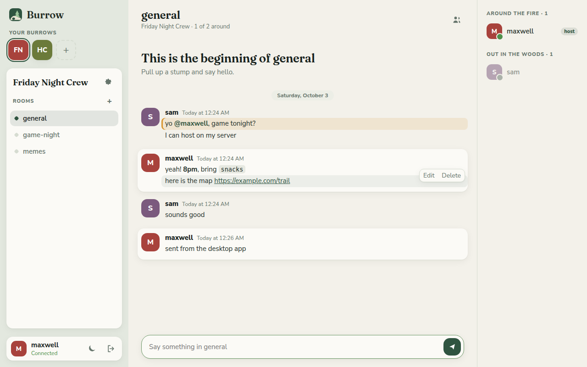

# Burrow

A small, self-hosted Discord-style chat for you and your friends. You run the
server on your own machine or a cheap VPS; your friends install the desktop app
(or just open the server's address in a browser) and log in.



**What works today**

- Accounts with username and password, protected by an optional registration code so strangers can't sign up
- Burrows (shared spaces) you create, with a picture, banner, description, welcome room and rules, and rooms that the host (or anyone whose role allows it) can add, put in order and group under headings
- Invite links that never run out, or that expire after a while or a number of uses, with a page that shows the burrow before joining
- Room topics, slow mode, announcement rooms only some roles can post in, and archived rooms that keep their history
- Muting a room, a burrow or a conversation for a while, or choosing all messages, only @mentions or nothing
- Events with RSVPs and a reminder, group conversations, and your own folders of burrows
- Custom roles with their own name, color and permissions, private rooms, and removing or banning people
- Voice rooms (via [LiveKit](https://livekit.io), self-hosted alongside Burrow) end-to-end encrypted, with mute and deafen, strong noise isolation, your choice of microphone, speakers and camera, who's-talking rings, a volume slider for each person, and camera and screen sharing
- Image and file sharing: attach, paste or drag in up to 10 files per message, with inline image and video previews
- Emoji reactions and replies (a reply to you counts as a mention)
- Direct messages with anyone you share a burrow with, one to one or in groups of up to 10
- Profile pictures and password changes (changing your password logs out your other devices)
- Real-time messaging over WebSockets, with typing indicators and online/offline presence
- Full message history with infinite scroll back, edit and delete your own messages (↑ edits your last one)
- Formatting: `**bold**`, `*italic*`, `__underline__`, `~~strikethrough~~`, `||spoilers||`, `` `code` ``, coloured code blocks, `# headings`, `> quotes`, lists, clickable links with previews, and `@mentions` (highlighted, and they trigger a desktop notification)
- Unread counts that remember where you stopped reading on every device, a "New" line, and a jump to the first unread message; mark a message unread to come back to it
- Search across your burrows and direct messages, by words, person, room, date or kind (pictures, links, polls…)
- Pinned messages, threads off any message, polls, forwarding, saved messages with reminders, and messages scheduled to send later
- An emoji picker, each burrow's own custom emoji and stickers, and voice messages
- Drafts kept per room, edit history on edited messages, long pastes sent as a text file you can read inline, and "Seen" in direct messages (you can turn it off)
- Desktop app for Windows, macOS and Linux (Electron), plus the same UI in any browser
- Scandinavian-forest look with light and dark themes


## Layout

```
chat-app/
├── server/     Node.js + TypeScript server (HTTP API, WebSockets, SQLite)
├── client/     The chat UI (plain HTML/CSS/JS), served by the server and bundled into the desktop app
├── desktop/    Electron wrapper that packages the client as an installable app
├── Dockerfile, docker-compose.yml
└── .github/workflows/desktop-release.yml   Builds installers on GitHub when you publish a release
```

The server has one runtime dependency (`ws`). It uses Node's built-in SQLite
and runs TypeScript directly, so there is no build step. It needs Node 22.18 or newer.

## 1. Run the server

### With Docker (recommended)

Copy the settings file and set a registration code only your friends will know:

```sh
cp .env.example .env
nano .env        # change REGISTRATION_CODE (and the voice secret, or remove the voice lines)
docker compose up -d --build
```

The server is now on port 3000, and its database lives in the `burrow-data` volume. All your
settings stay in `.env`, so updating is always:

```sh
git pull && docker compose up -d --build
```

### Without Docker

```sh
cd server
npm install
REGISTRATION_CODE=pick-something npm start
```

Data goes to `server/data/chat.db`.

### Settings

| Variable            | Default                | What it does                                                        |
| ------------------- | ---------------------- | ------------------------------------------------------------------- |
| `REGISTRATION_CODE` | unset (open signup)    | Code people must enter to create an account. Strongly recommended. |
| `PORT`              | `3000`                 | Port to listen on.                                                  |
| `DB_FILE`           | `server/data/chat.db`  | SQLite database location (`/data/chat.db` in Docker).               |
| `BACKUP_DIR`        | `backups/` next to the database | Where the daily database copies go (`/data/backups` in Docker). |
| `BACKUP_KEEP`       | `7`                    | How many daily copies to keep. `0` turns backups off.               |
| `LIVEKIT_API_KEY`, `LIVEKIT_API_SECRET` | unset (voice off) | Shared with LiveKit; turns on voice rooms.             |
| `UPLOAD_DIR`        | `uploads/` next to the database | Where shared files are stored (`/data/uploads` in Docker).  |
| `MAX_UPLOAD_MB`     | `25`                   | Largest file someone can share.                                     |
| `LIVEKIT_URL`       | same address as Burrow | Where apps reach LiveKit, if not routed through Burrow's address.   |
| `LIVEKIT_API_URL`   | `http://localhost:7880` | Where Burrow reaches LiveKit to disconnect removed people (Docker Compose points it at the host). |
| `KLIPY_API_KEY`     | unset (GIFs off)       | Turns on the GIF picker. See *GIFs* below.                          |
| `GIF_RATING`        | `pg-13`                | Which GIFs search shows: `g`, `pg`, `pg-13` or `r`.                 |

### Letting friends reach it

Your friends need to reach the server over the internet. The usual options:

1. **A VPS** (any $5/month box): run Docker Compose there and point a domain at it.
2. **Your home PC**: forward TCP port 3000 on your router to that machine and give friends your public IP.
3. **Tailscale**: everyone installs Tailscale and joins your tailnet; nothing is exposed publicly. Easiest and safest for a small group.

For anything public, put HTTPS in front so passwords aren't sent in the clear.
[Caddy](https://caddyserver.com) does it in two lines and handles WebSockets automatically:

```
chat.example.com {
    @livekit path /rtc /rtc/*
    reverse_proxy @livekit localhost:7880
    reverse_proxy localhost:3000
}
```

The `@livekit` lines are only needed for voice rooms (below); they're harmless without them.

### Voice rooms

Voice runs on [LiveKit](https://livekit.io), a media server that Docker Compose starts next to Burrow.
Voice only is light enough for a Raspberry Pi 4 or 5. The limit is usually your home upload
speed: LiveKit sends each speaker to every listener at about 40 kbps, so a room of 10 needs up to
about 4 Mbps of upload. Video is much heavier: each camera is up to about 1.7 Mbps and each shared
screen up to about 6 Mbps (1080p at up to 60 fps), per person watching. Video is only sent to people who have it open.

Voice and video are end-to-end encrypted: audio and video are scrambled on each person's device and only the others in the
room can unscramble it, so LiveKit (and anyone who got into the server) only ever handles noise. A new
key is made whenever someone joins or leaves, and only people still in the burrow get it. The lock in
the voice bar shows the room is encrypted. Everyone needs an up-to-date app for this.

Removing someone from a burrow, or leaving it, disconnects them from its voice rooms straight away.
Burrow asks LiveKit to do this directly (`LIVEKIT_API_URL`; Docker Compose sets it up).

1. Copy `.env.example` to `.env` in the same folder as `docker-compose.yml`, and replace the secret
   with the output of `openssl rand -base64 32`.
2. `docker compose up -d --build`. This now starts `livekit` too.
3. Add the two `@livekit` lines above to your Caddyfile and restart Caddy.
4. On your router, forward **TCP 7881** and **UDP 7882** to the server, alongside 80 and 443.

The host then adds a room with **+** next to *Rooms* and picks *Voice room*. Click a voice room to
join; the bar above your name has mute, deafen (hear nobody and mute your mic; everyone in the burrow
sees it), camera, screen sharing, the video view and leave, plus a sliders button for your
microphone, speakers and camera. Click someone in a voice room to turn them up or down (0% to 200%,
only for you).

Turning on your camera or sharing your screen shows everyone's video in place of the chat. Others see
a camera icon or a red **LIVE** tag next to your name, and open the video with the grid button in the
voice bar (or by clicking the voice room). Click a video to make it bigger, use the button in its
corner (or double-click) for full screen, and **Back to chat** to return. The member list hides while you watch. A shared screen with
sound starts muted; hover over it for its mute button and volume slider (0% to 200%, only for you).
Burrow remembers what you pick for each person. In the desktop app you pick a screen or window from Burrow's
own list, and *Smooth motion* (60 fps, for games and video) or *Sharp text* (keeps text crisp, for
documents and code); browsers share smooth motion. Sound: on Windows 10 (version 2004 or later) and 11,
the desktop app shares only the sound of the window you picked, or everything except Burrow when you
share a whole screen, so people don't hear themselves back. In Chrome or Edge, sharing a browser tab
shares that tab's sound, and sharing a whole screen on Windows shares all of the computer's sound.
Other cases share no sound. On a Mac, the first share asks for *Screen Recording* permission in System
Settings, and Burrow may need a restart after you allow it.

### GIFs

The **GIF** button in the message box searches [KLIPY](https://klipy.com), a free GIF library (Google shut down Tenor's API in June 2026). It needs a free key:

1. Sign up at [partner.klipy.com](https://partner.klipy.com).
2. Open **API Keys**, choose **Add Platform** (call it Burrow), and copy the key it makes.
3. Add `KLIPY_API_KEY=<the key>` to `.env` and run `docker compose up -d`.

Searches and previews go through your Burrow server, so the key never reaches anyone's app and KLIPY doesn't see your friends' addresses (it gets an anonymous id per person instead). A GIF that's sent is saved on your server like any shared picture, so old messages keep working. If KLIPY ever limits your key, ask for production access in its Partner Panel.

### Security

- Everything travels encrypted: Caddy serves HTTPS (and Burrow then tells browsers to always use it), and voice uses WebRTC's built-in encryption. Passwords are stored hashed with scrypt.
- Too many wrong passwords lock that account's login for 15 minutes; registration code guesses are limited per address the same way.
- Logins expire after 30 days without use. Changing your password logs you out everywhere else.
- With Docker, port 3000 only listens on the server itself, so the only way in is through Caddy. Set `BURROW_BIND=0.0.0.0` in `.env` if you run without a reverse proxy.
- The web app only runs its own scripts (a strict Content-Security-Policy), which blunts any injected code.

### Backups

Burrow copies its database once a day and keeps the last 7 copies. They sit on the same disk as
the server, so now and then copy them somewhere else. With Docker:

```sh
docker compose cp burrow:/data/backups ./backups
```

To restore one (swap in the date you want):

```sh
docker compose stop burrow
docker compose run --rm --entrypoint sh burrow -c "cp /data/backups/burrow-2026-10-05.db /data/chat.db && rm -f /data/chat.db-wal /data/chat.db-shm"
docker compose up -d
```

## 2. Get your friends the app

**Browser:** they open your server address (e.g. `https://chat.example.com`), click *Register*, and enter the registration code.

**Desktop app:** the first time it opens it asks for the server address, then works the same way.

To build installers, let GitHub do it: on the repo page go to **Releases → Draft a new release**,
type a new tag such as `v0.1.0`, and click **Publish release**. The `Desktop release` workflow then
builds a Windows `.exe`, macOS `.dmg` and Linux `.AppImage` and attaches them to that release,
usually within about ten minutes. Send your friends the release link.

**Updates:** the desktop app checks for a newer release when it starts and every six hours.
On Windows and Linux it downloads the update in the background and asks to restart; if they pick
*Later*, it installs the next time they quit. On macOS it shows a *Download* button that opens the
release page, because macOS only lets signed apps update themselves. Release tags must look like
`v1.2.3`; the tag becomes the app's version number.

You can also run the workflow by hand from the **Actions** tab to get test builds without publishing anything.

To build locally instead (each OS builds its own installer best):

```sh
cd desktop
npm install
npm start        # run it without packaging
npm run dist     # build an installer for the current OS into desktop/dist/
```

The installers are unsigned, so Windows SmartScreen will say "Windows protected your PC"
(click *More info → Run anyway*) and macOS needs right-click → *Open* the first time.
Code-signing certificates fix that but cost money.

## 3. Using it

Burrow has its own names for things: a **burrow** is a shared space for one group of friends (what Discord calls a server), and each burrow has **rooms** (channels).

- Click **+** under *Your burrows* to dig a new burrow, or join one with an invite link or code.
- The gear next to the burrow's name opens its settings. **Invite people** has a link that never runs out, and makes links that expire after a while or a number of uses; anyone in the burrow can make one. Opening a link in a browser shows the burrow's picture, banner and description before joining. **Notifications** mutes the burrow or sets it to all messages, only @mentions or nothing. The host, and roles allowed to *edit the burrow*, find **Edit burrow** there: its name, description, picture, banner, welcome room (where new people land) and rules (new people accept them before they can chat). The host can also hand the burrow to someone else there, and delete it; everyone else can leave. People whose role lets them ban also see who's banned there, and can unban them. People who can manage roles open **Roles** there.
- **Roles:** every burrow starts with a *Moderator* role. Under **Roles** you can make your own (like *Admins* or *Friends*), pick a color, choose what each one can do (manage rooms, delete messages, remove people, ban people, manage roles, edit the burrow), and move them up or down. Names show in the color of their highest role. People can only change roles, and remove people, below their own highest role, and can't hand out permissions they don't have. A role with no permissions is just a colored label.
- People who can manage rooms add rooms and headings with the **+** next to *Rooms*, where *Arrange rooms* also puts them in order (on a computer you can drag them too). Anyone can fold a heading away. The gear that appears when you hover over a room changes its name, topic, slow mode and who can see it, makes it an announcement room that only some roles can post in, archives it or deletes it. A private room is only seen by people who manage rooms, plus the roles and people you tick.
- The bell at the top of a room mutes it for a while, or sets it to all messages, only @mentions or nothing. Right-clicking a room in the list does the same.
- **Events** above the rooms plans a game night: pick a time and a room, and people answer *Going*, *Maybe* or *Can't go*. Everyone going or maybe going gets a reminder 15 minutes before.
- Your account (your picture, top right) and the sliders button on the voice bar have voice and video settings: which microphone, speakers or headset and camera to use (with a mic test and a camera preview), your volume and everyone's volume, noise isolation, and voice quality (48, 64 or 96 kbps). Noise isolation has four levels: *Off* (for music), *Light* (the browser's own filter), *Strong* (the default, [RNNoise](https://github.com/xiph/rnnoise)) and *Strongest* ([GTCRN](https://github.com/Xiaobin-Rong/gtcrn); takes out the most noise but makes voices a little flatter). Both run on your own device before your voice is encrypted. Picking speakers works in Chrome, Edge and the desktop app; Safari, iPhones and Firefox play through whatever the system picks. Account also has sound settings: chimes for new messages and for people joining or leaving your voice room, and how loud they are.
- Hover over someone in the member list and click **⋯** to give them roles, or to remove or ban them, depending on what your roles allow.
- The speech-bubble tile above your burrows holds your direct messages. Start one with its **+** (tick several people for a group conversation), or click someone in a burrow's member list. A group's gear renames it, adds people or leaves it.
- In the burrow list (*more* on a computer, or the burrow button on a phone), the folder button next to each burrow puts it in one of your own folders.
- Click your name in the bottom corner to set a profile picture or change your password.
- The **GIF** button next to the message box opens trending GIFs; type to search, and tap one to send it.
- The **+** in the message box uploads files, makes a poll, sends a sticker, or sends what you've typed later. The smiley opens every emoji (and your burrows' own), and the microphone records a voice message.
- Each message's **⋯** menu pins it, starts a thread, forwards it, saves it (or reminds you about it later), marks it unread, or shows its edit history. Your saved and scheduled messages are in your menu, top right.
- The magnifier at the top of a room searches messages; **Ctrl+K** (⌘K on a Mac) opens it from anywhere. The pin next to it lists the room's pinned messages.
- People whose role lets them *manage emoji* add a burrow's own emoji and stickers in its settings; type `:name:` to use one.
- The moon button in your profile card switches between the light "birch" theme and the dark "pine night" theme. By default it follows your system setting.
- Your account also has a **theme color** wheel: pick any color (nearer the middle is softer) or one of the presets, and Burrow's backgrounds and accents follow it in both light and dark. *Back to forest green* undoes it.

## Development

```sh
cd server
npm install
npm run dev      # restarts on changes; open http://localhost:3000
npm test         # end-to-end API and WebSocket tests
```

Client changes need only a browser refresh. The API is plain JSON over HTTP
with a bearer token, and live events come over `/ws?token=…`; see `server/src/app.ts`.

## Roadmap

Done: auto-update for the desktop app (fully automatic on macOS needs code signing), voice rooms, image and file sharing, reactions and replies, profile pictures and password changes, direct messages, custom roles with private rooms, per-person voice volume, notification sounds, camera and screen sharing, a GIF picker, burrow pictures, the chat and messages update (search, pins, threads, polls, link previews, voice messages, custom emoji and stickers, reminders, scheduled messages and more), and the rooms, burrows and organization update (headings and room order, topics, slow mode, announcement and archived rooms, invite links that run out, banners, rules and a welcome room, muting, events, group conversations and folders).

Ideas for later: text message encryption, sharing one program's sound on macOS.

## Alternatives

If you would rather run something mature than your own code, these are self-hostable
and Discord-like: [Revolt / Stoat](https://github.com/revoltchat) (closest look and feel),
[Matrix](https://matrix.org) with the Element client (federated, very full-featured, heavier to run),
and [Mumble](https://www.mumble.info) for voice only.
